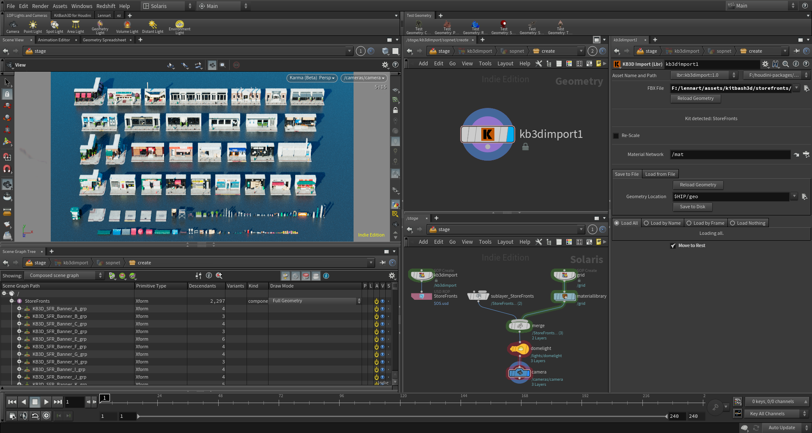

# KitBash3D for Houdini

## Overview

KitBash3D for Houdini (KB3DfH) is a free and open-source tool bundle to import [KitBash3D](https://kitbash3d.com/ "KitBash3d") kits into [SideFX Houdini](https://www.sidefx.com/ "SideFX Houdini"), prep the geometry for Solaris and export as BGEO and [USD](https://graphics.pixar.com/usd/docs/index.html "Introduction to USD") to be rendered in Mantra and Karma.

These tools are currently in BETA and are still being worked on.

## Getting started

To get started with *KB3DfH*, we put down a KB3D Import SOP anywhere on SOP level. We can put it down in a SOP Create LOP if we choose to stay inside Solaris.

Once we select the FBX file provided with your KB3D kit, the tool should detect the kit name and process the file accordingly. If the tool does not detect the kit, it's either not a valid kit from KitBash3D, the fbx file has been renamed or the tool has not yet been optimized for that specific kit.

Currently, *KB3DfH* supports six kits for **guaranteed** auto-detection:

- [Ancients](https://kitbash3d.com/collections/kits/products/ancient-temples "Ancients")
- [Egypt](https://kitbash3d.com/collections/kits/products/egypt "Egypt")
- [Greebles](https://kitbash3d.com/collections/kits/products/props-greebles "Props: Greebles")
- [Secret Lab](https://kitbash3d.com/collections/kits/products/props-secret-labs "Props: Secret Labs")
- [Storefronts](https://kitbash3d.com/collections/kits/products/storefronts "Storefronts")
- [Wasteland](https://kitbash3d.com/collections/kits/products/wasteland "Wasteland")

Check the contribute section for how you can help to add more.

**Please be aware that the tool is built in a way, where unsuppoted kits *should* still be processed correctly.**

Once the kit is selected, we can do some manual overwrites if we want to change the scale of the imported asset or the root name of the path.

---

We also need to specifiy a material network that holds all the necessary shaders. Please check the [Importing shaders](#Importing-shaders) section for more info.

---

The next part reads like a normal File Cache SOP. We can define an output directory and some load settings (Packed disks etc.).

---

Lastly, we can choose four ways of importing:

1. Load All: Imports all objects at once.
2. Load by Name: Imports specified objects by their respective name attribute
3. Load by Frame: Each object is saved on a specific frame. Can be used to browse objects.
4. Load Nothing: Used to export only. Objects can be imported by a standard File SOP.

Additionally to all these import modes, we can choose to move the objects to their "rest position". The kits from KitBash3D usually come with their objects spread out in an ordered layout (small to big). When saving the objects to disk, this order needs to be removed and all objects need to be moved to scene centre. Before doing so, the original layout is saved in the rest attribute and can be restored at any time (usually for import mode 1: *Load All*).

### Importing shaders

Shaders can be imported in different ways, depending on the kit we are using.

1. Many recent kits from KitBash3D come with a dedicated Houdini file. While the way the node tree is layed out is undesirable, the shaders are setup perfectly. We can just merge the file into our projects and use the materials provided.

2. If the kit does not have a Houdini file, we use the FBX Importer inside Houdini to load the kit as an FBX. The FBX Importer unfortunately is slow and doesn't translate the materials perfectly. Some manual intervention might be required to adjust the shaders to the desired quality.

**We recommend to use the Houdini file whenever possible**

---

It is recommended to move the **KB3DTexture** folder into your current project folder ($HIP) whenever using this tool since the materials usually look for their textures at `$HIP/KB3DTextures/[texture_file]`. If we choose not to do that, we can use the provided [Batch Replace Texture Paths](#Batch-Replace-Texture-Paths) shelf tool to re-link all missing textures.

---

Lastly, we can always build our own shaders by either using the same shader name as in the shop_materialpath attribute or overwriting/re-assigning materials by the path or name attribute.

### Batch Replace Texture Paths

To be completed.

### Export as USD

Inside Solaris we can put down a SOP Create LOP and inside put down a KB3D Import SOP. After following the instructions of the [Gettings started](#Getting-started) section, the objects should be optimized for Solaris and USD. Autofill Materials on the SOP Create LOP populates our kit with the necessary shaders and we can put down a USD ROP for export.

In a blank Houdini scene, we can test out the USD file by reading it in through a Sublayer LOP.

## Installation

To be completed.

## Troubleshooting

To be completed.

## Contribute

To add more kits to the auto-detection, please send an email to lennart.breede@gmail.com with the FBX file name, the scale when importing into Houdini and an example of it's name attribute.

## Donate

To be completed.