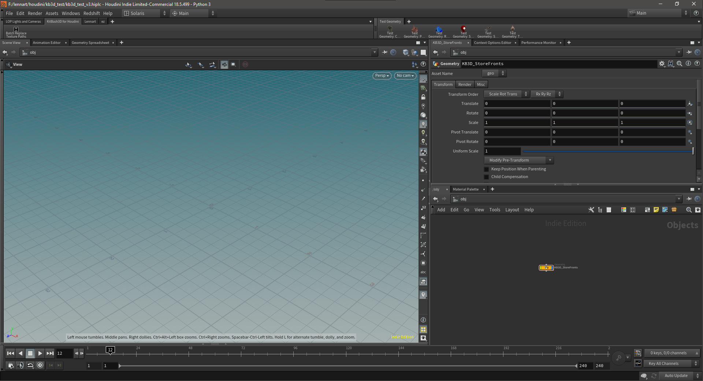

# KitBash3D for Houdini

## Overview

KitBash3D for Houdini (KB3DfH) is a free an opensource tool bundle to import [KitBash3D](https://kitbash3d.com/) kits into [SideFX Houdini](https://www.sidefx.com/), prep the geometry for Solaris, export as BGEO and USD and render in Mantra or Karma.

These tools are currently in BETA and are still being worked on.

## Getting started

To get started with *KB3DfH*, we put down a KB3D Import SOP anywhere on SOP level. We can put it down in a SOP Create LOP if we hchoose to stay inside Solaris.

Once we select the FBX file provided with you KB3D kit, the tool should detect the kit name and process the file accordingly. If the tool does not detect the kit, it's either not a valid kit from KitBash3D, the fbx file has been renamed or the tool has not yet been optimized for that specific kit.

Currently, *KB3DfH* supports six kits for auto-detection:

- Ancient Temples
- Egypt
- Greebles
- Secret Lab
- Storefronts
- Wasteland

Check the contribute section for how you can help to add more.

**Please be aware that the tool is built in a way, where unsuppoted kits *should* still be processed correctly.**

test image:

## Installation

To be completed.

## Troubleshooting

## Contribute

## Donate

## KB3D Import

Advanced FBX Importer / Bgeo Exporter for KB3D Kits

Features include:

- Kit name detection
- Path creation
- KB3D shader assignment
- USD prep

## Shelf Tools

This repo comes with a handful of useful shelf tools.

### Shader Path Replacement

Batch texture path replacement for the principled shader

## To Be Implemented

- [ ] Add py3 to README
- [ ] Added dir selection for batch replace texture path tool
- [ ] Added custom prefix/root dir to path
- [x] Fix kit detection script
- [ ] Added custom fallback kit back it
- [ ] Hide custom fallback field when kit detected