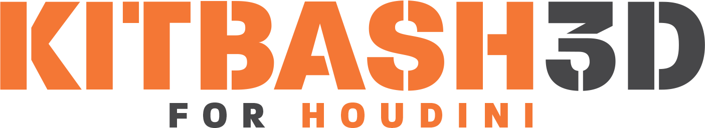

# KitBash3D for Houdini

## Overview

KitBash3D for Houdini (KB3DfH) is a free an opensource tool bundle to import [KitBash3D](https://kitbash3d.com/) kits into [SideFX Houdini](https://www.sidefx.com/), prep for rendering in Mantra or Karma and export as BGEO and USD.

## Getting started

To get started with _KB3DfH_, we put down a KB3D Import SOP in either a Geometry Object or a SOP Create LOP, depending on your preferred way of working and 

test image:

Kit auto-detection and process for:

- Ancient Temples
- Egypt
- Greebles
- Secret Lab
- Storefronts
- Wasteland

 6/50 Kits optimized for auto-detection

## Installation

To be completed.

## KB3D Import

Advanced FBX Importer / Bgeo Exporter for KB3D Kits

Features include:

- Kit name detection
- Path creation
- KB3D shader assignment
- USD prep

## Shelf Tools

This repo comes with a handful of useful shelf tools.

### Shader Path Replacement

Batch texture path replacement for the principled shader

## To Be Implemented

- [ ] Add py3 to README
- [ ] Added dir selection for batch replace texture path tool
- [ ] Added custom prefix/root dir to path
- [x] Fix kit detection script
- [ ] Added custom fallback kit back it
- [ ] Hide custom fallback field when kit detected